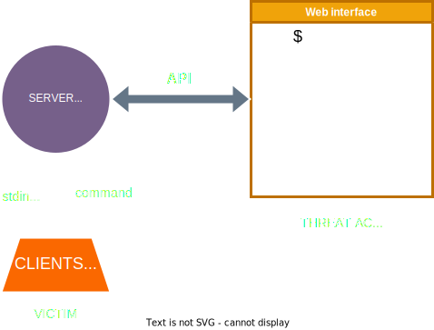
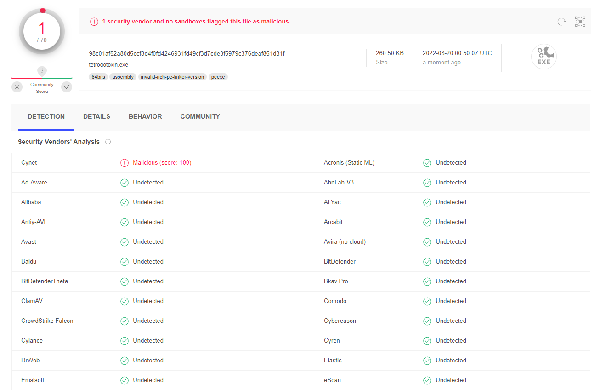
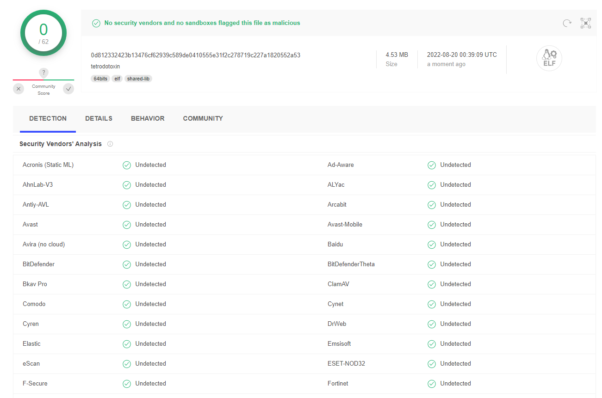
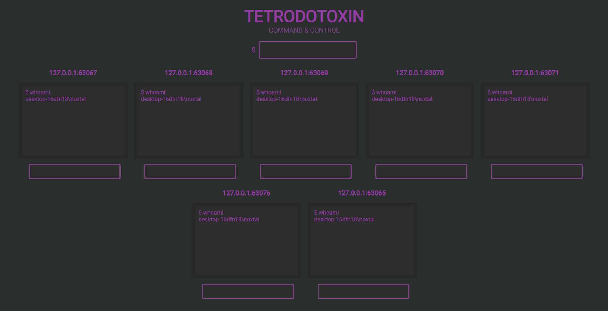
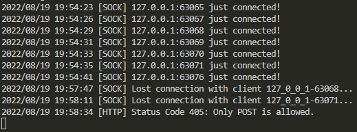

# tetrodotoxin
> ⚠️ **Be careful**: Use this *malicious* software at YOUR OWN RISKS!

[](https://github.com/Noxtal/tetrodotoxin/blob/master/LICENSE)
[](https://github.com/Noxtal/tetrodotoxin/stargazers)

A Rust malware controlled by a Go web interface, API and socket server. See [Objectives](#objectives) for more details.

- [tetrodotoxin](#tetrodotoxin)
  - [Objectives](#objectives)
  - [Etymology](#etymology)
  - [Usage](#usage)
  - [Network structure](#network-structure)
  - [VirusTotal](#virustotal)
  - [Screenshots](#screenshots)
  - [TODO](#todo)

## Objectives
1. Bring a new malware to the recent Rust malware development scene to use Rust's youth as a way to show undetectability fairly easily.
2. Abusing Go's networking versatility and ease of use for both managing client sockets and the webserver to build a complete architecture.
3. Having multiple clients centralized to the same socket server and interface.

## Etymology
```
Tetrodotoxin (TTX) is a potent neurotoxin. Its name derives from Tetraodontiformes, an order that includes pufferfish, porcupinefish, ocean sunfish, and triggerfish; several of these species carry the toxin. Although tetrodotoxin was discovered in these fish and found in several other animals [...], it is actually produced by certain infecting or symbiotic bacteria like Pseudoalteromonas, Pseudomonas, and Vibrio as well as other species found in animals.
```
(source: [Wikipedia](https://en.wikipedia.org/wiki/Tetrodotoxin))


## Usage
Find the necessary binaries in the corresponding [Release](https://github.com/Noxtal/tetrodotoxin/releases). Launch the server binary locally and make sure external connections may reach it. Get on `localhost:80` and watch your own Command and Control Center appear. As for infection, simply get a foothold into the victim and execute the client binary (relying on the target OS, obviously). When it is all done, refresh the webpage and your first client will indeed appear! Use the top bar to send commands to every socket and the smaller ones to choose from individually.

## Network structure



## VirusTotal
Windows:



Linux:



## Screenshots
Web interface:



Logs:



## TODO
Hopefully, version 2.0.0 should come with its load of features!
- [ ] Implementing persistence
- [ ] Memorizing the current directory for the next command
- [ ] Beating Cynet
- [ ] MacOS support

Future fantasies...
- [ ] Allowing automated modules in a Metasploit/Meterpreter style
- [ ] Selecting the directory from a drop-down
- [ ] Filtering by OS
- [ ] Spreading through the clients